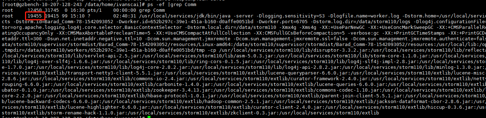
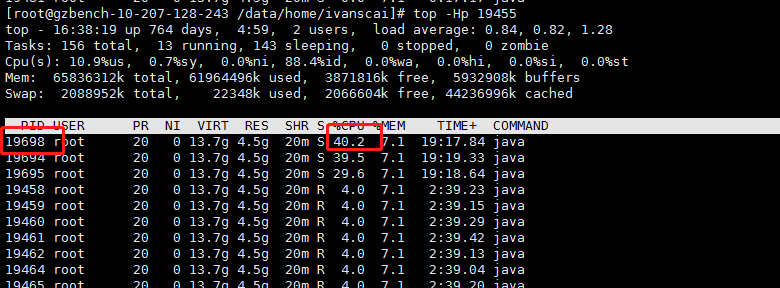
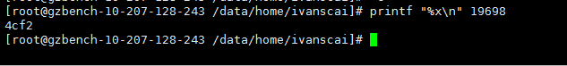
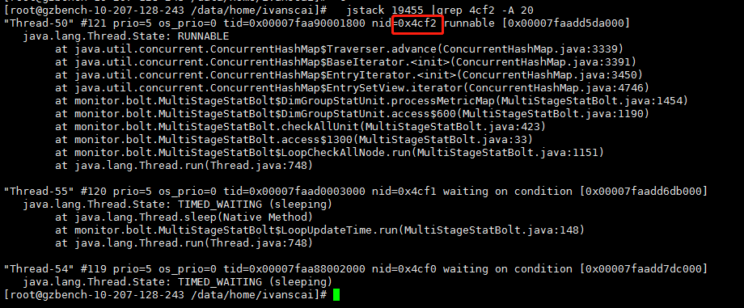
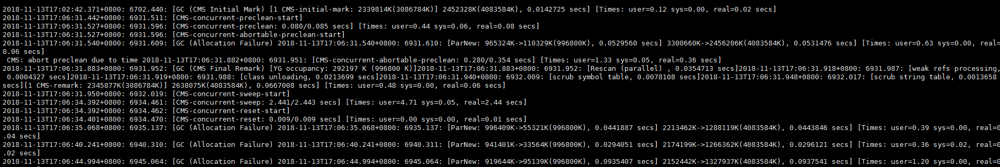
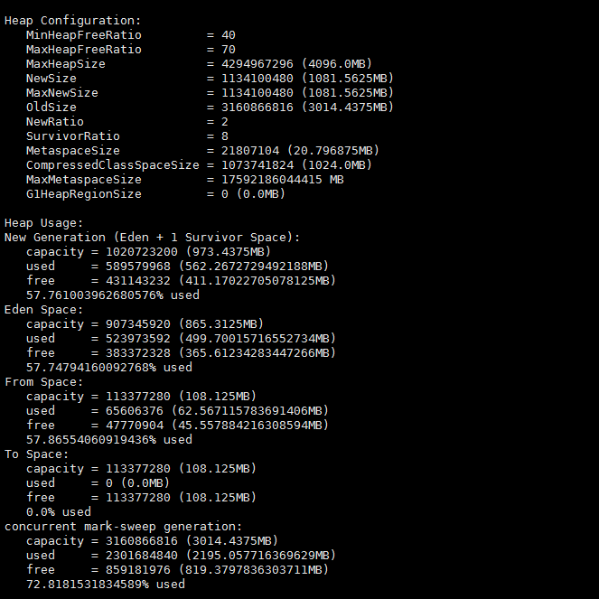

## java应用性能分析

​	一个应用在性能压测时，可能会有性能问题，一般都会体现在cpu和内存两方面。以下结合自身经历总结一下java应用性能分析的流程。

- ​	[high cpu分析](#high cpu分析)
- ​        [内存分析](#内存分析)

### high cpu分析

- 1、获取进程ID

  这里很简单，我定位的是storm的worker，所以可以直接通过Topology名称（Barad_Comm）过滤，获取进程ID为19455

  ```shell
  ps -ef |grep Barad_Comm
  ```

  

- 2、找出该进程最耗CPU的线程

  通过top命令查看，得到该进程最耗CPU的线程PID，为19698

  ```shell
  top -Hp 19455
  ```

  

- 3、获取线程的16进制值，并查看jstack信息

  ```shell
  printf "%x\n" 19698
  ```

  

  ​得到4cf2​	后，grep进程为19455的jstack

 ```shell
  jstack 19455 |grep 4cf2 -A 20
 ```

​	

​	这样看到是processMetricMap这个方法里面的迭代器耗费cpu（这里只是举个例子），再结合代码逻辑是否循环new对象了，即可定位到具体代码。

##### 小结

​	进程很耗CPU，一般来说有几种情况：

​	*  循环执行操作

​	*  频繁GC

​	如果是GC相关，那还需要进一步进行内存分析，以确定代码中哪里创建了大量对象占用内存。

​	gc有时候耗时很长，还会影响storm worker到zk的心跳，导致重启

### 内存分析

​	java的内存工具十分齐全，visual vm、jstat、jmap等。

* 查看gc日志

  可以看出来是CMS在一直进行垃圾回收

  

* 查看堆使用情况

  ```shell
  jmap -heap 19455
  ```

  这里可以看出内存占用过多，所以触发GC

  

* 查看gc次数（用来查看gc情况）

  ```shell
  jstat -gcutil 19455 1000
  ```

* 生成dump文件

  其实通过上述操作已经基本知道哪里可能有问题了。如果实在不清楚，可以使用jmap -histo:live 19455直接在机器上查看哪个对象占用内存过大，但要具体分析的话最好是生成dump文件，然后用mat分析。

  ```shell
  jmap -dump:format=b,file=heapdump.bin 19455
  ```

  生成以后，可以压缩之后，sz到本地，用mat工具打开

* mat使用


